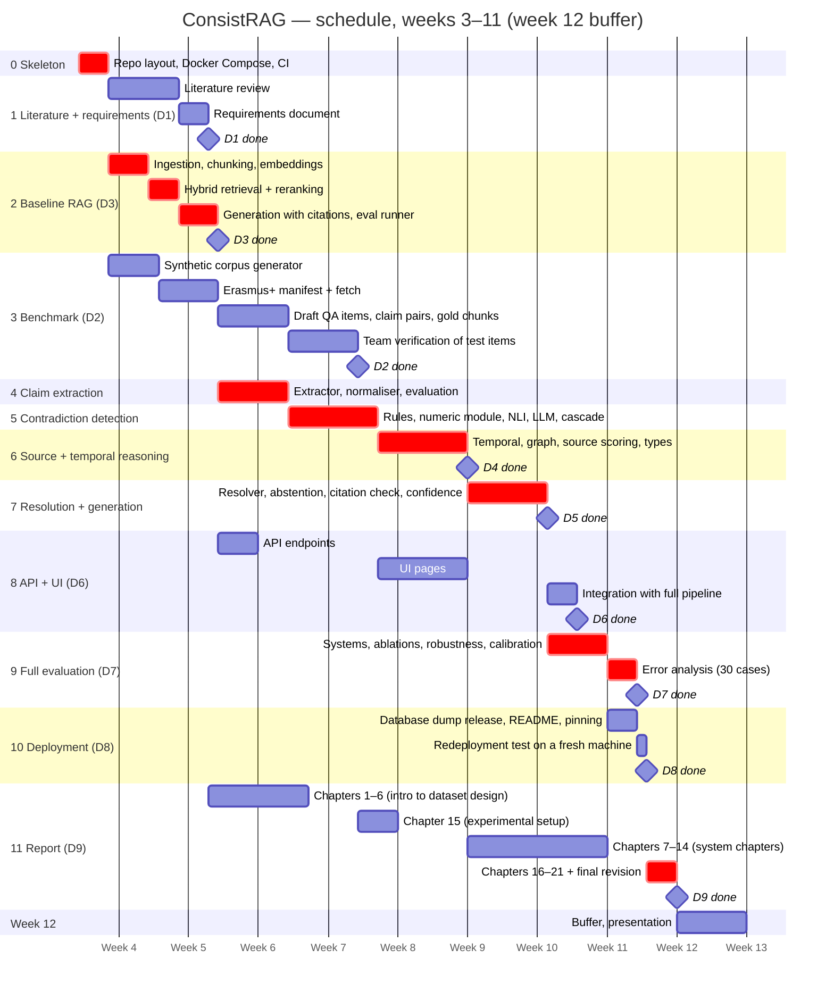

# ConsistRAG — Schedule

The semester has 12 weeks. Work starts in **week 3** (Thursday 1 October 2026) and the project must be complete by
the **end of week 11** (Sunday 29 November 2026). Week 12 is kept free as buffer and for the presentation. Every task
is chained to the tasks it depends on. Red bars are the critical path; a delay there delays the end date. A rendered copy
is in `img/gantt.png`.

The chart axis shows semester weeks. Mermaid only understands calendar dates, so the chart uses a stand-in calendar
where week 1 starts on 1 January 2024; the table below gives the real dates. To shift the plan, change only the start
date of `p0`.

## Same plan with real dates

| Phase | Weeks | Start | End | Depends on |
|---|---|---|---|---|
| 0 Skeleton | 3 | Thu 1 Oct | Sat 3 Oct | — |
| 1 Literature + requirements (D1) | 3–5 | Sun 4 Oct | Tue 13 Oct | 0 |
| 2 Baseline RAG + eval runner (D3) | 3–5 | Sun 4 Oct | Wed 14 Oct | 0 |
| 3 Benchmark (D2) | 3–7 | Sun 4 Oct | Wed 28 Oct | 0 (team verification 22–28 Oct) |
| 4 Claim extraction | 5–6 | Thu 15 Oct | Wed 21 Oct | 2 |
| 5 Contradiction detection | 6–7 | Thu 22 Oct | Fri 30 Oct | 4 |
| 6 Source + temporal reasoning (D4) | 7–8 | Sat 31 Oct | Sun 8 Nov | 5 |
| 7 Resolution + generation (D5) | 9–10 | Mon 9 Nov | Mon 16 Nov | 6 |
| 8 API + UI (D6) | 5–10 | Thu 15 Oct | Thu 19 Nov | API after 2; UI after 5; integration after 7 |
| 9 Full evaluation (D7) | 10–11 | Tue 17 Nov | Wed 25 Nov | 7, team verification |
| 10 Deployment (D8) | 11 | Mon 23 Nov | Thu 26 Nov | 8, evaluation runs |
| 11 Report (D9) | 5–11 | Wed 14 Oct | Sun 29 Nov | chapters written after the phases they describe |
| Buffer, presentation | 12 | Mon 30 Nov | Sun 6 Dec | — |

## Notes

- **Compression:** the earlier plan needed about 14 weeks; this one fits in 8.5. More work runs in parallel (UI alongside
  source reasoning, report chapters alongside the system phases), and each phase is shorter. There is no slack before
  week 12.
- **Your tasks:** team verification (22–28 Oct), GPU runs on the RTX 4060 during phases 4–9 (claim extraction for the
  corpus, all evaluation runs 17–22 Nov), and the redeployment test (26 Nov).
- **Riskiest points:** claim extraction (one week) and the evaluation week, which can only start once phase 7 is done.
- **If a phase slips by more than two days,** cut scope in this order rather than moving the end date:
  1. benchmark 300 → 200 items and the pair set 600 → 400;
  2. robustness sets reduced to passage-order permutation only;
  3. Platt scaling instead of isotonic calibration;
  4. UI evaluation dashboard reduced to static result tables.
