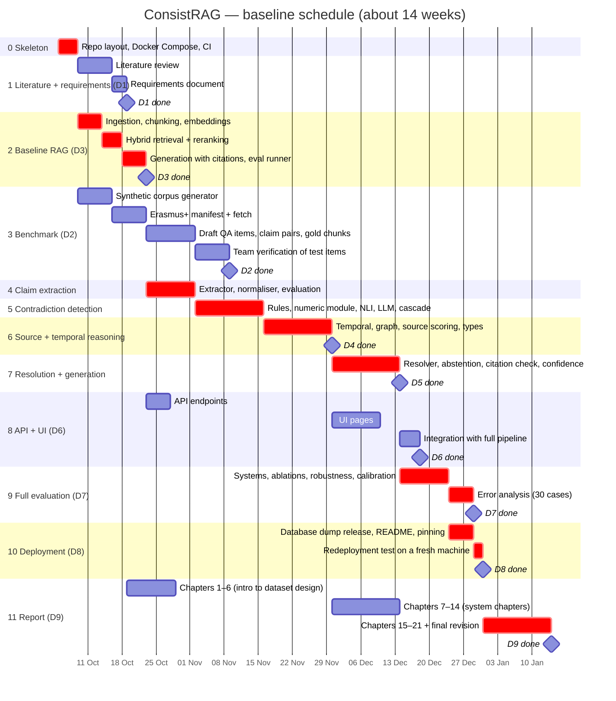

# ConsistRAG — Schedule

Baseline plan for the phases in `design.md` §9. There are no fixed deadlines, so dates are estimates from a start on
**Monday 5 October 2026**. Every task is chained to the tasks it depends on: to shift the whole plan, change only the
start date of `p0` below. Red bars are the critical path; a delay there delays the end date. A rendered copy is in `img/gantt.png`.

## Same plan as a table

| Phase | Start | End | Depends on |
|---|---|---|---|
| 0 Skeleton | 5 Oct | 8 Oct | — |
| 1 Literature + requirements (D1) | 9 Oct | 18 Oct | 0 |
| 2 Baseline RAG + eval runner (D3) | 9 Oct | 22 Oct | 0 |
| 3 Benchmark (D2) | 9 Oct | 8 Nov | 0 (team verification is the last week) |
| 4 Claim extraction | 23 Oct | 1 Nov | 2 |
| 5 Contradiction detection | 2 Nov | 15 Nov | 4 |
| 6 Source + temporal reasoning (D4) | 16 Nov | 29 Nov | 5 |
| 7 Resolution + generation (D5) | 30 Nov | 13 Dec | 6 |
| 8 API + UI (D6) | 23 Oct | 17 Dec | API after 2; UI after 6; integration after 7 |
| 9 Full evaluation (D7) | 14 Dec | 28 Dec | 7, team verification |
| 10 Deployment (D8) | 24 Dec | 30 Dec | 8, 9 |
| 11 Report (D9) | 19 Oct | 13 Jan | chapters written after the phases they describe |

## Notes

- **Your tasks:** the team verification week (phase 3), running GPU experiments on the RTX 4060 (phases 4–9), and the
  redeployment test (phase 10). Everything else Claude can draft or build, with your review.
- **Buffer:** the plan has no slack built in. The end-of-year holidays fall in phases 9–10; if the semester ends later,
  move them out rather than compressing the evaluation.
- **Riskiest estimate:** claim extraction (phase 4). If a 7B model extracts claims poorly, the fallback in `design.md`
  §4.1 is used and phase 5 starts on time.
