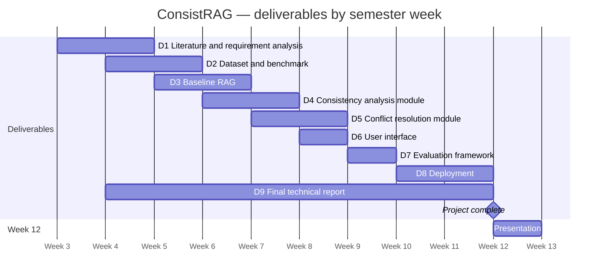

# ConsistRAG — Schedule

An indicative plan of the deliverables in `project_spec.md` §34 over the 12-week semester. Work runs from week 3 to
week 11; week 12 is for the presentation. The detailed phase plan is in `design.md` §9. A rendered copy is in
`img/gantt.png`.

| Deliverable | Weeks |
|---|---|
| D1 Literature and requirement analysis | 3–4 |
| D2 Dataset and benchmark | 4–5 |
| D3 Baseline RAG | 5–6 |
| D4 Consistency analysis module | 6–7 |
| D5 Conflict resolution module | 7–8 |
| D6 User interface | 8 |
| D7 Evaluation framework | 9 |
| D8 Deployment | 10–11 |
| D9 Final technical report | 4–11 |
| Presentation | 12 |
